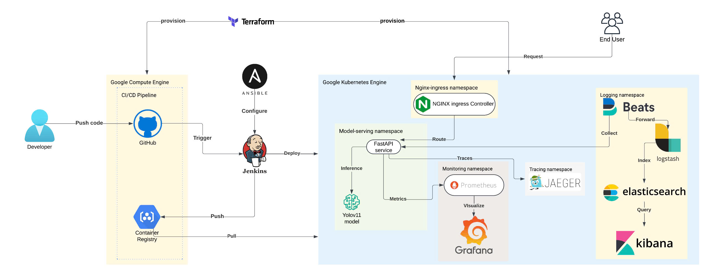
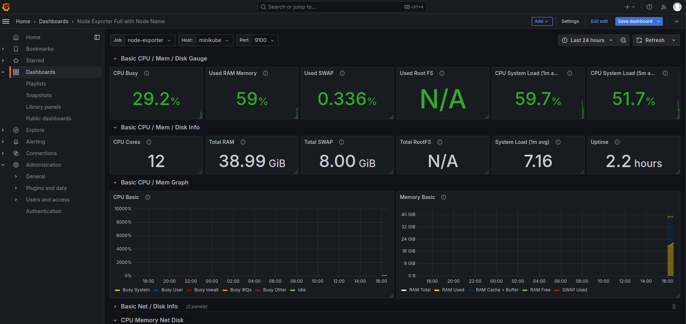

# CI/CD Pipeline for ML Model Deployment with Observability Stack on Google Kubernetes Engine

## Overview
This project implements a complete MLOps pipeline for deploying a face detection service using YOLOv11. Built on modern cloud-native technologies, it provides end-to-end automation for deploying, monitoring, and scaling ML models in production.

Key Features:
- **ML Service**: YOLOv11-based face detection, containerized for production
- **Cloud Infrastructure**: Automated GCP setup using Terraform and Ansible
- **Kubernetes Deployment**: Scalable orchestration on GKE
- **Comprehensive Monitoring**: 
  - Resource metrics (Prometheus + Grafana)
  - Log management (ELK Stack)
  - Request tracing (Jaeger)
- **Automated CI/CD**: Jenkins pipeline with testing and deployment
- **Security**: RBAC, network policies, secret management

### System Architecture
The system architecture diagram below illustrates the main components and their interactions:


*Architecture diagram showing:*
1. User interaction layer with API gateway
2. Kubernetes cluster components:
   - Face detection service pods
   - Nginx ingress controller
   - Monitoring stack (Prometheus, Grafana)
   - Logging stack (ELK)
   - Tracing (Jaeger)
3. CI/CD pipeline flow
4. Infrastructure components

## Prerequisites
- Google Cloud account with billing enabled
- Local tools:
  - gcloud CLI
  - Terraform 
  - kubectl and kubens
  - Helm 3+
  - Helmfile
  - Docker Desktop
  - Make

## Infrastructure Setup

### 1. Google Cloud Configuration

1. Install and configure gcloud:
```bash
# Follow: cloud.google.com/sdk/docs/install
gcloud init
gcloud auth application-default login
```


2. Create service account:
- Set up Kubernetes Engine Admin role
- Save key to `infrastructure/credentials/`
- Configure `terraform/main.tf`


### 2. Cluster Deployment

1. Set up SSH keys:
```bash
cd infrastructure
make generate-key
```

2. Deploy GKE:
```bash
make init
make plan
make apply
```

3. Configure access:
```bash
gcloud container clusters get-credentials [CLUSTER_NAME] --region [REGION]
kubectx [CLUSTER_NAME]
```


## Application Deployment

### Service Setup

1. Create namespaces:
```bash
kubectl create ns model-serving model-serving
kubectl create ns model-serving nginx-ingress
```

2. Install components:
```bash
# Deploy ingress controller
helm upgrade --install nginx-ingress app/deployments/nginx-ingress --namespace nginx-ingress 

# Deploy face detection
helm upgrade --install face-detection app/deployments/face-detection --namespace model-serving
```

### Testing

1. Check service status:
```bash
kubectl get svc -n model-serving
```

2. Verify endpoints:
```bash
# Health check
curl http://[SERVICE_IP]:8000/health

# Face detection
curl -X POST http://[SERVICE_IP]:8000/detect/faces/image \
  -F "image=@/path/to/image.jpg"
```


## Observability Stack

### Monitoring Setup

1. Deploy stack:
```bash
# Using Helmfile
cd observable_systems/K8s
helmfile sync

# Using Docker
cd observable_systems/Docker
docker compose up -d
cd elk && docker compose up -d
```

### Dashboards Access

1. Grafana (`http://[NODE_IP]:30000`):
```bash
# Get user admin password
kubectl get secret kube-prometheus-stack-grafana \
  -o jsonpath="{.data.admin-password}" | base64 --decode
```



2. Kibana (`http://[NODE_IP]:5601`):
```bash
# Get user elastic password
kubectl get secret elasticsearch-master-credentials \
  -o jsonpath="{.data.password}" | base64 --decode
```


3. Jaeger UI (`http://[NODE_IP]:16686`)


## CI/CD Pipeline

### Jenkins Installation

1. Connect to GCE:
```bash
ssh -i ssh_keys/jenkins_key [USERNAME]@[GCE_EXTERNAL_IP]
```

2. Access UI:
- Open `http://[GCE_EXTERNAL_IP]:8081`
- Get admin password:
```bash
sudo docker exec jenkins cat \
  /var/jenkins_home/secrets/initialAdminPassword
```


### Pipeline Configuration

1. Set up credentials:
- DockerHub access
- GCP service account
- Kubernetes config

2. Configure pipeline:
- Create pipeline job
- Link Git repository
- Set up Jenkinsfile


### Deployment Process

Pipeline stages:
1. Code validation
2. Testing
3. Image building
4. Registry push
5. GKE deployment

